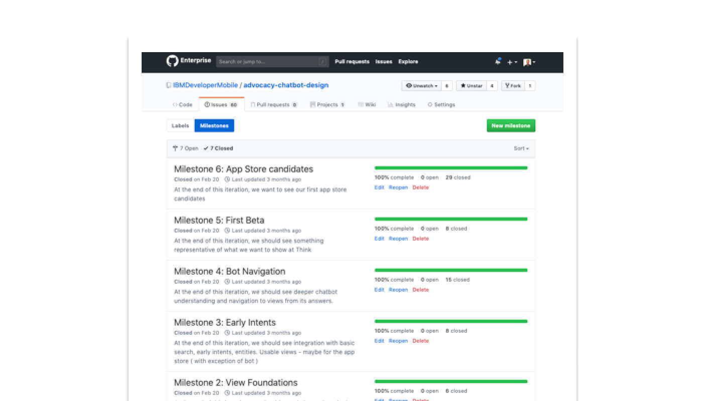

# Rapid Development of Scaleable Mobile Apps with Containers

Many businesses need to create new mobile experiences, from datasets that were not structured with mobile in mind. Earlier this year we launched a native mobile app version of IBM Developer.

It introduced an experimental chatbot component that utilized Elastic Search. It was built in just 12 weeks with a very small team of contributors, distributed across four continents! A mini product creation, from concept to corporately approved app, built on IBM Cloud.

Our young IBM Developer App uses Elastic Search to index a library of content. We create APIs around the indexed content for various needs.

Equipped with a set of tailored APIs, we can develop efficient mobile app views - a chatbot, content views, an event app, to liberate the legacy content in fresh, modern ways.

Customer's [expectations are higher than they've ever been](https://www.gartner.com/en/newsroom/press-releases/2019-04-04-gartner-says-the-future-of-app-development-is-multiex) for fast, mobile, and secure access to information. Cloud based, container based solutions with micro-services, offer the only real flexible, scalable future for the enterprise. Yet [only 20% of enterprise software has moved to the cloud](https://www.ibm.com/blogs/cloud-computing/2019/03/05/20-percent-cloud-transformation/).

Our app was created as a side project, that we've watched and learned from. The team that built it was new to app development, and had to research, learn and adapt quickly, so that the app was robust and scalable for thousands of people to use at the same time. We thought that we'd turn our experience into a collection of code patterns, and articles that enterprise teams, and independent developers might learn from too. A lot of our approaches are 'standard' patterns for surfacing and scaling data with Kubernetes, or OpenShift.

### Agile/Scrum approach

We wanted to build the chatbot/mobile app in time for the 2019 Think Conference, which was held in February. Our work started at the tail end of 2018. We scoped out milestone stepping stones, not more than 2 weeks apart. Each milestone was purposefully a mini internal product, albeit some of those mini products did very little.

### System Architecture

### Creating a Chatbot Built on Legacy Data  

### Testing for Scale using Artillery.io

### Monitoring usage with LogDNA  
